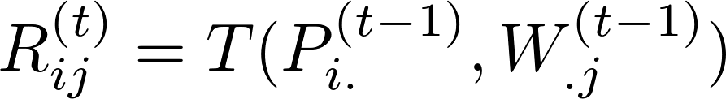
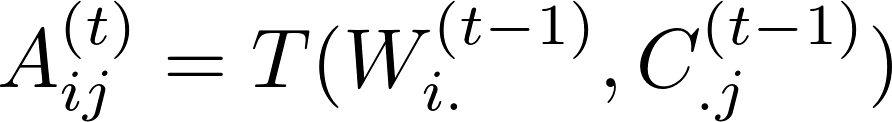
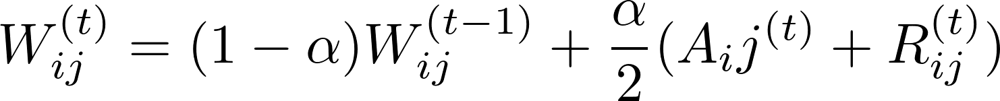
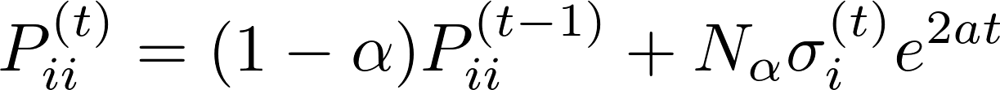
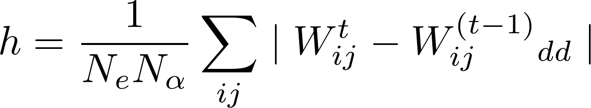

## Description
Forked from [https://github.com/QuackenbushLab/pypanda](https://github.com/QuackenbushLab/pypanda), 
which was based on [https://github.com/davidvi/pypanda](https://github.com/davidvi/pypanda).  
Compared to QuackenbushLab/pypanda this repository adds the Python implementation of PUMA ([run_puma.py](run_puma.py) and [pypanda/puma.py](pypanda/puma.py)).  
  
## Table of Contents
* [Links to literature](#links-to-literature)
* [Panda algorithm](#panda-algorithm)  
* [Installation](#installation)  
* [Usage](#usage)  
  * [Run from terminal](#run-from-terminal)
  * [Run from python](#run-from-python)
* [Toy data](#toy-data)
* [Results](#results)


## Links to literature 

* **[PUMA](https://static-content.springer.com/esm/art%3A10.1186%2Fs13045-017-0465-4/MediaObjects/13045_2017_465_MOESM3_ESM.pdf)** (PANDA Using MicroRNA Associations)  
_Manuscript in preparation, used in [PUMA](https://static-content.springer.com/esm/art%3A10.1186%2Fs13045-017-0465-4/MediaObjects/13045_2017_465_MOESM3_ESM.pdf)._  
C and MATLAB code: [https://github.com/mararie/PUMA](https://github.com/mararie/PUMA)

* **[PANDA](http://journals.plos.org/plosone/article?id=10.1371/journal.pone.0064832)** Passing Attributes between Networks for Data Assimilation  
_Glass K, Huttenhower C, Quackenbush J, Yuan GC. Passing Messages Between Biological Networks to Refine Predicted Interactions, PLoS One, 2013 May 31;8(5):e64832_  
Original PANDA C++ code: [http://sourceforge.net/projects/panda-net/](http://sourceforge.net/projects/panda-net/).  

* **[LIONESS](https://arxiv.org/abs/1505.06440)** (Linear Interpolation to Obtain Network Estimates for Single Samples)   
_Marieke Lydia Kuijjer, Matthew Tung,GuoCheng Yuan,John Quackenbush, Kimberly Glass. Estimating sample-specific regulatory networks_  

LIONESS can be used to estimate single-sample networks using aggregate networks made with any network reconstruction algorithm (http://arxiv.org/pdf/1505.06440.pdf).

## Panda algorithm
To find agreement between the three input networks first the responsibility (R) is calculated.  

  

Thereafter availability (A) is calculated.  

  

Availability and responsibility are combined with the following formula.  

  

Protein cooperativity and gene co-regulatory networks are updated.  

  
  

P and C are updated to satisfy convergence.  

  
  

Hamming distance is calculated every iteration.  

  


## Installation
PyPanda runs on both Python 2.7 and Python 3.4. We recommend the following commands to install PyPandas on UNIX systems:
#### Using  a virtual environment
Using [python virtual environment](http://docs.python-guide.org/en/latest/dev/virtualenvs/) is the cleanest installation method. 

Cloning git and setting up the [python virtual environment](http://docs.python-guide.org/en/latest/dev/virtualenvs/):
```no-highlight
pip install --user pipenv   #Make sure you have Pipenv
git clone https://github.com/aless80/pypanda.git
cd pypuma
virtualenv pypumaenv #virtual environment created in a folder inside the git folder 
source pypumaenv/bin/activate
```
Installing pypuma:
```no-highlight
(pypumaenv)$ pip install -r requirements.txt
(pypumaenv)$ python setup.py install
```

Complete uninstall of pypuma:
```no-highlight
(pypuma)$ deactivate	#Quit virtual environment
rm -rf pypumaenv
write about uninstalling the setup using --record
```

#### Using pip 
Never use sudo pip. Instead you can use pip on the user's install directory:
```no-highlight
git clone https://github.com/aless80/pypanda.git
cd pypuma
python setup.py install --user
#to run from the command line you will need to make pypuma executable and add the bin directory to your PATH:
cd bin
chmod +x pypuma
echo "$(pwd):PATH" >> ~/.bashrc
source ~/.bashrc
```
To run PyPuma from Windows (tested on Windows 10) install Git (https://git-scm.com/downloads) and Anaconda Python2.7 (https://www.continuum.io/downloads) and from the Anaconda prompt run:
```no-highlight
git clone https://github.com/aless80/pypanda.git
cd pypuma
python setup.py install
```

## Usage
#### Run from terminal
PyPandas can be run directly from the terminal with the following options:
```
-h help
-e, --expression (required) expression values
-m, --motif (required) pair file of motif edges, when not provided analysis continues with Pearson correlation matrix
-p, --ppi (required) pair file of PPI edges
-o, --output (required) output file
-i, --mir (required) mir data
```
To run PyPuma on toy data:
```
python run_panda.py -e ./ToyData/ToyExpressionData.txt -m ./ToyData/ToyMotifData.txt -p ./ToyData/ToyPPIData.txt -o test_puma.txt
python run_puma.py -e ./ToyData/ToyExpressionData.txt -m ./ToyData/ToyMotifData.txt -p ./ToyData/ToyPPIData.txt -o test_puma.txt -i ./ToyData/ALEToyMiRList.txt
```
To reconstruct a single sample Lioness Pearson correlation network:
```
$ pypanda -e ToyData/ToyExpressionData.txt -o test_puma_pearson.txt -q test_lioness_pearson.txt
```
#### Run from python
Fire up your python shell or ipython notebook. 
Import PyPuma library:
```python
from pypuma import Puma
from pypuma import Lioness
import pandas as pd
```
Run Puma algorithm, leave out motif and PPI data to use Pearson correlation network:
```python
p = Puma('ToyData/ToyExpressionData.txt', 'ToyData/ToyMotifData.txt', 'ToyData/ToyPPIData.txt', remove_missing=False)
```
Save the results:
```python
p.save_puma_results(file = 'Toy_Puma.pairs')
```
Return a network plot:
```python
plot = AnalyzePuma(p)
plot.top_network_plot(top=100, file='top_100_genes.png')
```
Calculate indegrees for further analysis:
```python
indegree = p.return_puma_indegree()
```
Calculate outdegrees for further analysis:
```python
outdegree = p.return_puma_outdegree()
```
Run the Lioness algorithm for single sample networks:
```python
l = Lioness(p)
```
Save Lioness results:
```python
l.save_lioness_results(file = 'Toy_Lioness.txt')
```
Return a network plot for one of the Lioness single sample networks:
```python
plot = AnalyzeLioness(l)
plot.top_network_plot(column= 0, top=100, file='top_100_genes.png')
```

## Toy data
The example gene expression data that we have available here contains gene expression profiles for different samples in the columns. Of note, this is just a small subset of a larger gene expression dataset. We provided these "toy" data so that the user can test the method. 

However, if you plan to model gene regulatory networks on your own dataset, you should use your own expression data as input.

## Results
```
Example Panda output:
TF  Gene  Motif Force
---------------------
CEBPA	AACSL	0.0	-0.951416589143
CREB1	AACSL	0.0	-0.904241609324
DDIT3	AACSL	0.0	-0.956471642313
E2F1	AACSL	1.0	3.6853160511
EGR1	AACSL	0.0	-0.695698519643

Example lioness output:
Sample1 Sample2 Sample3 Sample4
-------------------------------
-0.667452814003	-1.70433776179	-0.158129613892	-0.655795512803
-0.843366539284	-0.733709815256	-0.84849895139	-0.915217389738
3.23445386464	2.68888472802	3.35809757371	3.05297381396
2.39500370135	1.84608635425	2.80179804094	2.67540878165
-0.117475863987	0.494923925853	0.0518448588965	-0.0584810456421

TF, Gene and Motif order is identical to the panda output file.
```
